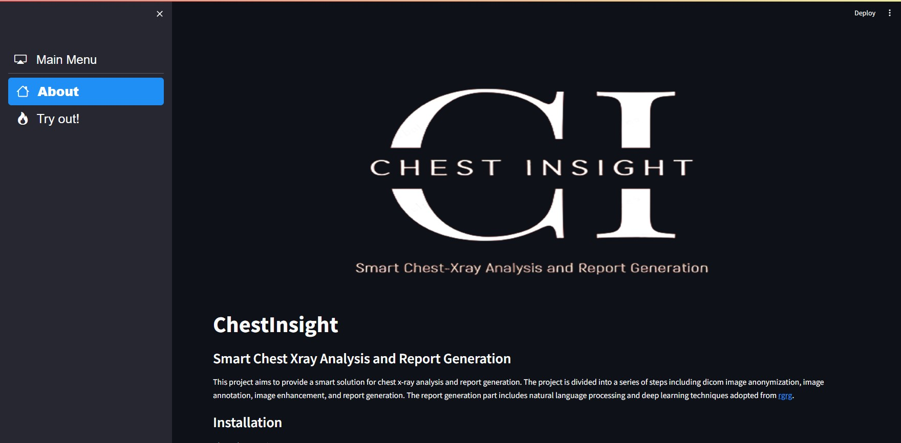
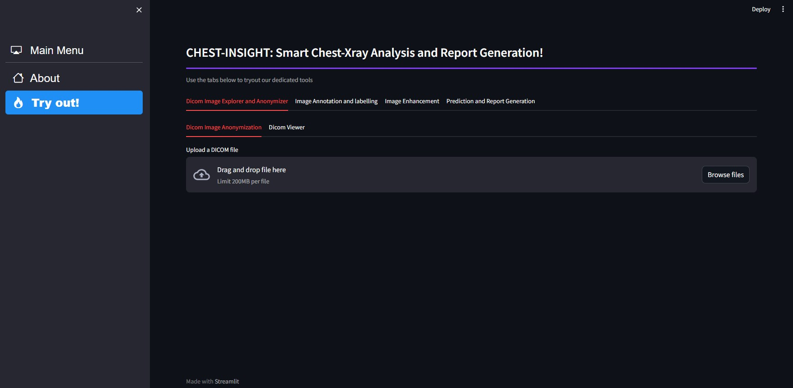

# ChestInsight
### Smart Chest Xray Analysis and Report Generation

Welcome to ChestInsight repository. ChestInsight is an open-source software project developed to provide a smart solution for chest x-ray analysis and report generation. 
ChestInsight has features like dicom image anonymization, image annotation, image enhancement and report generation. The report generation part includes natural language processing and deep learning techniques adopted from [rgrg](https://github.com/ttanida/rgrg).
### Demo


### Installation
Clone the repository:

```git clone https://github.com/rdiptan/ChestInsight.git```

To install the required packages, run the following command:

```pip install -r utils/requirements.txt``` 

### Usage

To use the project, run the following commands:

```cd src```
```streamlit run main.py``` 

Note: All data files must be located in ```.data/```

After running the ```main.py``` file with the command above, you should be welcomed with the following web page:


Using the sidebar, navigate to ```Try out```, the following page gives you access to a heirachy of *CHEST-INSIGHT Tools*. Each tab is named by it's function and does exactly as described.


### Try out each of the tools and let us know what you think!
### Contributing

Contributions are welcome! Please feel free to submit a pull request.

### Contributors
- [Muhammad Kabir Hamzah](https://github.com/Marshall-mk)
- [Beyza Zayim](https://github.com/beyza17)
- [Muhammad Alberb](https://github.com/Muhammad-Al-Barbary)
- [Diptan Regmi](https://github.com/rdiptan)
- [Faisal Farhan](https://github.com/f-farhan)
- [Aya Ahmed Faeek Elgebaly](https://github.com/AYAELGEBALY)

